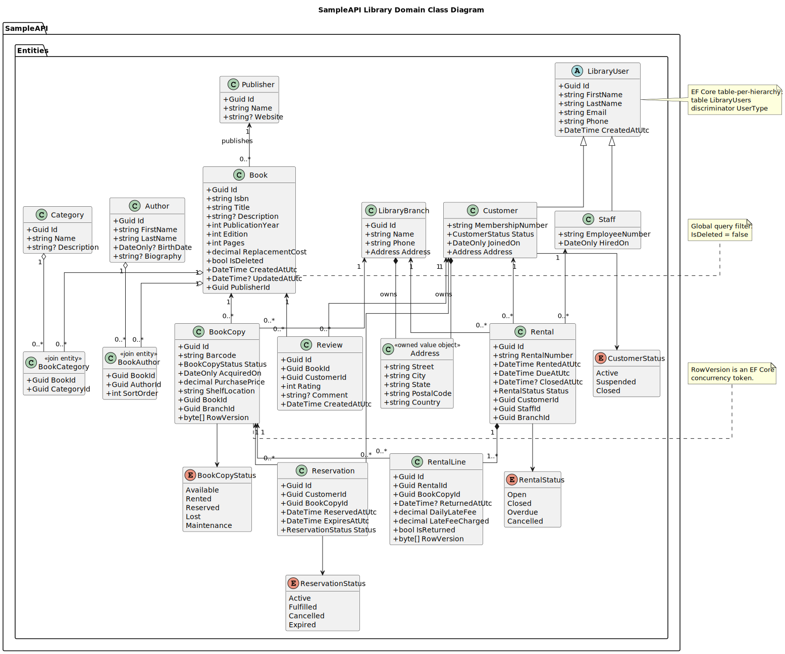
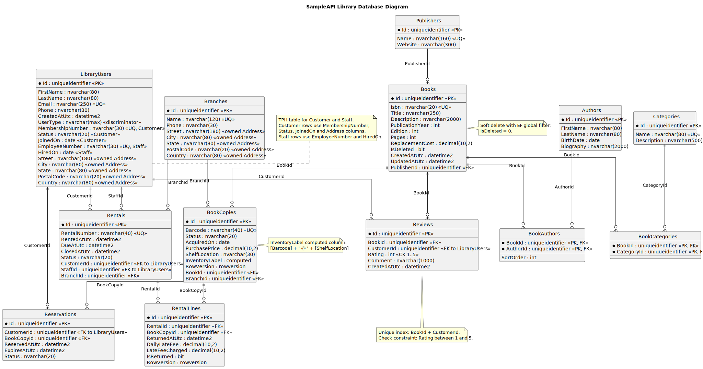

# EF Core Library API Showcase

ASP.NET Core API that models a Persian library system and demonstrates EF Core against SQL Server.

## Diagrams

### Domain Class Diagram



[PlantUML source](docs/class-diagram.puml)

### Database Diagram



[PlantUML source](docs/db-diagram.puml)

## Run

```powershell
dotnet restore
dotnet run
```

The app uses SQL Server LocalDB by default:

```json
"LibraryDb": "Server=(localdb)\\MSSQLLocalDB;Database=EfCoreLibraryShowcaseV2;Trusted_Connection=True;TrustServerCertificate=True;MultipleActiveResultSets=True"
```

On startup, `Database.Migrate()` applies the included migration and seed data.

Swagger UI is served from the application root:

```text
http://localhost:<port>/
```

OpenAPI JSON is available at `/openapi/v1.json`.

The seed data includes Persian library content: 3 Iranian branches, 8 Persian books, 8 customers, 8 authors, 4 publishers, 6 categories, 16 book copies, rentals, reservations, and reviews.

## Main Endpoints

- `GET /api/books`
- `GET /api/books/{id}`
- `POST /api/books`
- `PUT /api/books/{id}`
- `DELETE /api/books/{id}` soft deletes a book
- `POST /api/books/copies`
- `PATCH /api/books/copies/{copyId}/status`
- `POST /api/books/{bookId}/reviews`
- `GET /api/customers`
- `POST /api/customers`
- `GET /api/customers/{id}/rentals`
- `GET /api/rentals`
- `POST /api/rentals`
- `POST /api/rentals/{id}/return`
- `GET /api/reservations`
- `POST /api/reservations`
- `POST /api/reservations/{id}/cancel`
- `GET /api/lookups/authors`
- `GET /api/lookups/categories`
- `GET /api/lookups/publishers`
- `GET /api/lookups/branches`
- `GET /api/lookups/staff`

## EF Core Features Demonstrated

- SQL Server provider and migrations
- Fluent API configuration
- Seed data with `HasData`
- One-to-many relationships
- Many-to-many relationships through join entities with payload
- Owned entity types for addresses
- Table-per-hierarchy inheritance for library users
- Enum-to-string value conversions
- Global query filters for soft-deleted books
- Matching filters for dependent entities
- Unique and composite indexes
- Check constraints
- Computed columns
- Decimal precision configuration
- Rowversion concurrency tokens
- Restrictive delete behavior
- Projection queries with `AsNoTracking`
- `Include` / `ThenInclude` workflow updates
- `ExecuteDeleteAsync` for set-based join cleanup
- Execution strategy and explicit transaction in rental creation
